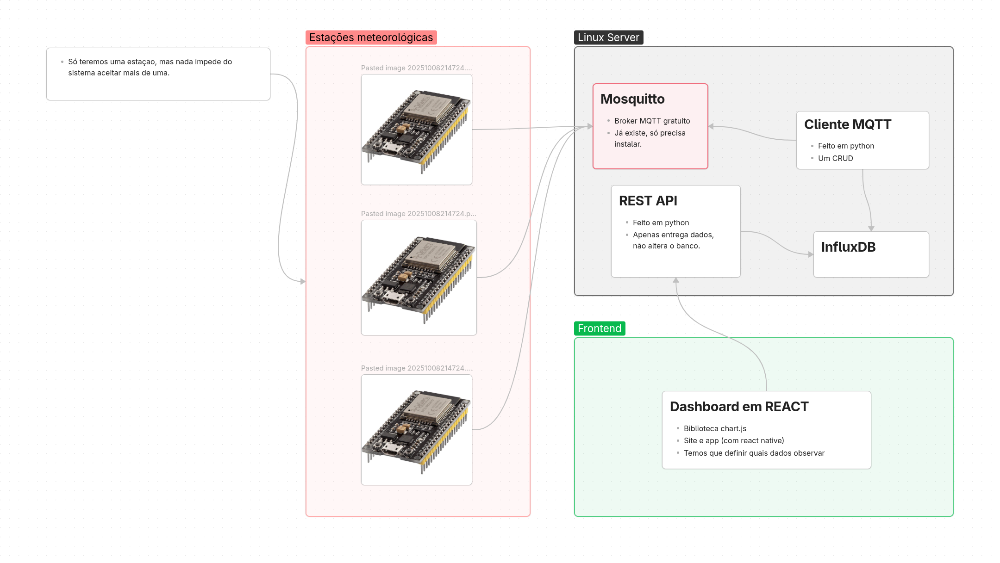

# Projeto de estação meteorológica
Precisamos de um nome melhor.

Objetivo: Monitorar dados de sensor de microcontroladores e exibi-los em dashboards.

O plano inicial é esse:


## Executar o Projeto
O projeto foi feito para executar em um servidor rodando Debian 13. Por ser um projeto em Docker, ele pode rodar em qualquer Linux e no Windows se você utilizar o WSL, mas as instruções foram testadas no Debian 13.

### Dependências
+ Docker
+ Docker compose
+ Ser capaz de rodar containeres docker com Linux

### Preparação
Adicione duas contas do mosquitto em um arquivo `m̀osquitto-conf/pass-file` utilizando o utilitári `mosquitto_passwd`, uma para o cliente MQTT e outra para as estações meteorológicas.
```console
# docker run --rm --user 1883:1883 -ti -v "$PWD"/mosquitto-config:/mosquitto/config eclipse-mosquitto mosquitto_passwd -c /mosquitto/config/pass-file <usuario1>

# docker run --rm --user 1883:1883 -ti -v "$PWD"/mosquitto-config:/mosquitto/config eclipse-mosquitto mosquitto_passwd -c /mosquitto/config/pass-file <usuario2>
. . .
```
Perceba que somente a primeira camada de `mosquitto_passwd` tem o argumento `-c`. **Quaisquer outras chamadas não podem conter o argumento `-c`, ele sobreescreve o arquivo.**

Copie o arquivo `.env.example` para `env` e edite seus valores. Os comentários explicam o que cada variável faz.
```console
$ cp .env.example .env
```

Inicie o projeto com o docker compose
```console
# docker compose up -d
```

